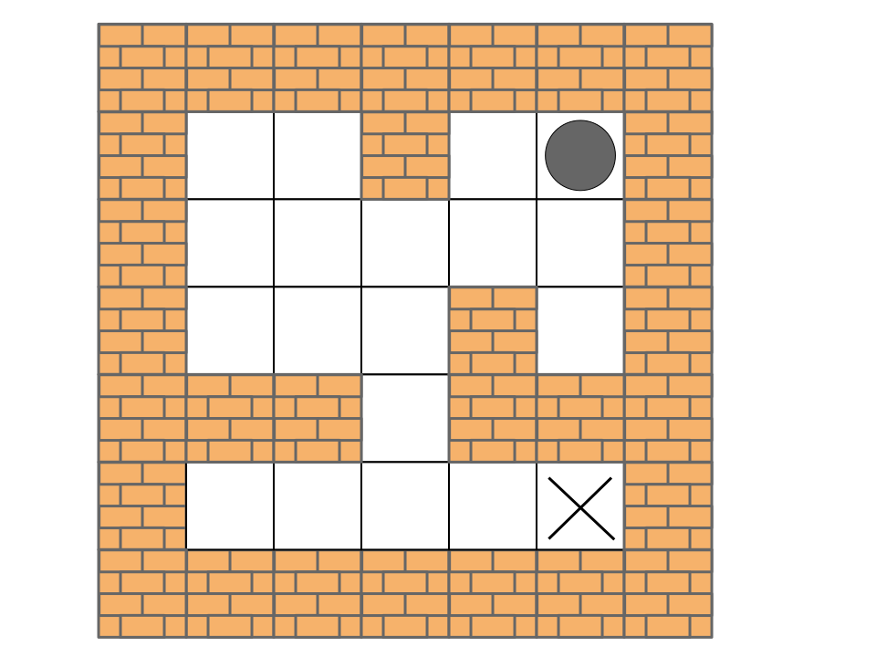

### Problem Statement

This set of problems I've found online -- they are sort-of related parts of the same question on the same topic that I imagine could be asked back-to-back as follow ups and are meant to be increasing in difficulty. As is the case with many problems with follow-ups (e.g. those found in places like CodeJam) to solve a follow-up requires some extra trick or a new structure / algorithm. So you could solve all of these with virtually the same code, if you know which method to use.

The questions are about mazes ([https://en.wikipedia.org/wiki/Maze](https://en.wikipedia.org/wiki/Maze)). Here are the links for online judge

[490. The Maze](https://leetcode.com/problems/the-maze/)

[505. The Maze II](https://leetcode.com/problems/the-maze-ii/)

[499. The Maze III](https://leetcode.com/problems/the-maze-iii/)

A maze is usually just some space with walls and walkways that one needs to navigate. The idea is that we usually have some source location on a 2D grid that comprises the maze and some destination location (like exiting the maze, but not always), and we want to solve the problem with some constraints of navigating inside a given maze while given such start / destination goals. Sometimes navigating the maze means "walking" i.e. we can take a single step in any legal direction assuming there isn't a wall there, but in the case of these problems we are presented with a ball and we are told that we can roll the ball in any valid direction and that such a ball will roll until it stops at a wall. 

Problem statement for the first problem quoting directly from the link above

> There is a ball in a `maze` with empty spaces (represented as `0`) and walls (represented as `1`). The ball can go through the empty spaces by rolling **up, down, left or right**, but it won't stop rolling until hitting a wall. When the ball stops, it could choose the next direction. 
>
> Given the `m x n` `maze`, the ball's `start` position and the `destination`, where `start = [star_row, start_col]` and `destination = [destination_row, destination_col]`, return `true` if the ball can stop at the destination, otherwise return `false`.
>
> You may assume that **the borders of the maze are all walls**.

This is definetely easier to visualize with a drawing and an example (note how the walls in the drawing correspond exactly to the 1's on the board and also how the drawing has extra walls around the maze for visualization, since that is mentioned in the prompt)

```python
maze = [
    [0,0,1,0,0],
    [0,0,0,0,0],
    [0,0,0,1,0],
    [1,1,0,1,1],
    [0,0,0,0,0]
]
start = [0,4]
destination = [4,4]
```



The expected output for this testcase would be `true`, since one possible way we could roll the ball is **left → down → left → down → right → down → right**, finally arriving at the destination node.

Here is a different example 

```python
maze = [
    [0,0,1,0,0],
    [0,0,0,0,0],
    [0,0,0,1,0],
    [0,0,0,1,1],
    [0,0,0,0,0]
]
start = [0,4]
destination = [2, 1]
```


The expected output for this scenario would be `false`, since there is no way to roll the ball such that it stops at the destination location. 

I like to think of this setup as basically trying to play golf in straight lines in a maze with these constraints, or it actually also reminds me of the maze rolling thingy game from HBO's Westworld show. Imagine the maze / grid is a 2D game that we can hold in our hands and we can tilt it to roll the ball in any of the four valid directions, the question becomes — can we tilt the maze and roll the ball from the start location such that it ends up in the destination location? For this particular question, the ball has to **stay in the destination location,** i.e. just rolling over a location is insufficient.

### Solution for "Maze I"

The first step is modelling the maze and the potential locations of the ball — as we might roll it — as a graph. Consider the first example maze, starting point, and destination again


What are our options to roll the ball to from the starting location? We can roll left to coordinate [0, 3] and roll down to [2, 4]. We can't roll upwards or to the right since we would just end up in the same spot. We can keep manually inspecting which destination cells one can reach given the maze and a starting coordinate, but given any coordinate in the maze, we can compute *all* of the possible destinations from that point, which will always be at most 4 (one roll in every direction). That means that every legal location on the maze where a ball can stop is connected to all other legal locations. The key here is *legal location*, since we are told that the ball will only stop when it hits a wall, so cells that the ball would roll through and not stop at would not qualify and this makes the graph sparser. As a directed graph it will look something like this


It is clear now that the answer to the problem of whether or not it is possible to reach the destination with the ball, is __whether or not there is a path from the node that represents the start location to the node that represents the destination location__. For our example and proposed solution directions (which direction to roll), there indeed is a path, and it would look like this


This is for the following ball rolling directions

```
left → down → left → down → right → down → right
```

So, we have a directed graph (cycles are obviously allowed though) + path problem, and right now we only care to know if a path exists, so a simple graph traversal is enough. Below is one solution that we can use with breadth-first search and a simple wrapper class representing a location node in the graph (`i`, `j` coordinate)

```python
from typing import List

"""
Wrapper class for a Location representing an x,y location in the maze.
"""
class Location():
    def __init__(self, cell):
        self.cell = cell
    
class Solution:
    """
    Simple util for whether the given coordinates are inside the bounds of the maze and also are not a wall.
    """
    def is_valid(self, maze, i, j, n, m):
        return i >= 0 and i < n and j >= 0 and j < m and maze[i][j] == 0

    """
    Solution for "Maze I".
    """
    def hasPath(self, maze: List[List[int]], start: List[int], destination: List[int]) -> bool:
        n, m = len(maze), len(maze[0])
        
        queue = [Location(start)]
        
        # Since the maze is a graph, we need to keep track of which locations we've visited. We can
        # use a set, but since the maze is represented as a 2D grid, we can use the same 2D grid to
        # mark which locations have been visited.
        visited = [[False for _ in range(m)] for _ in range(n)]
        
        while queue:
            curr = queue.pop(0)
            curr_i, curr_j = curr.cell
            
            if curr_i == destination[0] and curr_j == destination[1]:
                return True
            
            if visited[curr_i][curr_j]:
                continue
            visited[curr_i][curr_j] = True
            
            # At each location, we can at most generate 4 destination locations to which the ball can roll.
            dirs = {
                'u': [-1, 0],
                'd': [1, 0],
                'l': [0, -1],
                'r': [0, 1]
            }
            
            for dir_name in dirs:
                coords = dirs[dir_name]
                next_i, next_j = curr_i, curr_j

                # Given the current location, we create the next available locations by 'rolling' as far
                # to each side as possible. We know to stop when we either face a wall or the bounds of the
                # maze.
                while self.is_valid(maze, next_i + coords[0], next_j + coords[1], n, m):
                    next_i += coords[0]
                    next_j += coords[1]
                    
                # Send this 'next suggested' location to the queue to be visited breadth-first.
                if not visited[next_i][next_j]:         
                    node = Location([next_i, next_j])
                    queue.append(node)
                
        # If we end up here, that would mean that we explored the entire maze by rolling the ball in various legal
        # directions from the source location, but didn't at any time encounter the coordinates of the destination.
        # This must mean that there is no way to reach the destination in this maze according to the
        # rules of the maze.
        return False
```

### Solution for "Maze II"

Here is the problem statement of the follow-up, quoted from the link

> There is a ball in a `maze` with empty spaces (represented as `0`) and walls (represented as `1`). The ball can go through the empty spaces by rolling **up, down, left or right**, but it won't stop rolling until hitting a wall. When the ball stops, it could choose the next direction.
>
> Given the `m x n` `maze`, the ball's `start` position and the `destination`, where `start = [start_row, start_col]`and `destination = [destination_row, destination_col]`, return *the shortest **distance** for the ball to stop at the destination*. If the ball cannot stop at `destination`, return `-1`.
>
> The **distance** is the number of **empty spaces** traveled by the ball from the start position (excluded) to the destination (included).
>
> You may assume that **the borders of the maze are all walls.**

The question didn't change by much, but now we also have a minimization objective. We are asked to try to navigate the maze with the same rules and constraints as before, but now need to do so in the shortest way possible, where the cost is how many cells we roll through. This makes sense for the follow-up, since looking at the graph representation in the initial problem we can see that in certain scenarios there are certainly multiple ways to reach a destination node given a start node (multiple paths in the graph). So, how do we modify the solution / approach to now handle this additional constraint and pick the "correct" path?

An edge from a node (location) to another node (also location) means that we can succesfully roll the ball between these two nodes. When we roll the ball we definitely traverse some number of cells depending on the maze and we can definitely keep track of that as we generate the new coordinates from any single location. What we have now is a weighted directed graph, with the weight being the distance a ball rolls from one location to the next.

This is the updated (and slightly reduced for space / clarity purposes) graph representation


Since we have the requirement to "return the shortest distance for the ball to stop at the destination", we need to find the shortest path in this graph (or `-1` if there is no path, of course), so we can use [Dijkstra's Shortest Path](https://en.wikipedia.org/wiki/Dijkstra%27s_algorithm). I'll avoid discussing how (and why) the algorithm works, but there are some great YouTube videos out there as well as articles about it.

The 1 min summary is that it helps us find the shortest distance from a single source location (node) to, technically, every other node in the graph, although in this case we only care about the destination node. It does this by traversing the graph in a similar way BFS does, but instead of a simple queue it uses a priority queue (usually seen implemented with a [heap](https://en.wikipedia.org/wiki/Heap_(data_structure))) to order the vertices according to a property of distance / weight.

The code pretty much stays the same, with only additions being around keeping track of the steps as we roll the ball and modifying the code to use a heap to store location nodes which are prioritized by comparing their distances

```python
import heapq
from typing import List

"""
Wrapper class for a Location representing an x,y location in the maze. We use this structure to be able
to compare one location to another in terms of distance traveled.
"""
class Location():
    def __init__(self, cell, distance):
        self.cell = cell
        self.distance = distance

    """
    The requirement is to take as few steps to the destination (hole) as possible and we can implement this
    logic via this comparison function such that locations for us to visit in the maze are ordered by this
    weight.
    """
    def __lt__(self, other):
        return self.distance < other.distance
    
class Solution:
    """
    Simple util for whether the given coordinates are inside the bounds of the maze and also are
    not a wall.
    """
    def is_valid(self, maze, i, j, n, m):
        return i >= 0 and i < n and j >= 0 and j < m and maze[i][j] == 0

    """
    Solution for "Maze II".
    """
    def shortestDistance(self, maze: List[List[int]], start: List[int], destination: List[int]) -> int:
        n, m = len(maze), len(maze[0])
        
        # For Dijkstra's shortest path we need a priority queue via a heap.
        heap = [Location(start, 0)]
        heapq.heapify(heap)
        
        # Since the maze is a graph, we need to keep track of which locations we've visited. We can
        # use a set, but since the maze is represented as a 2D grid, we can use the same 2D grid to
        # mark which locations have been visited.
        visited = [[False for _ in range(m)] for _ in range(n)]
        
        while heap:
            curr = heapq.heappop(heap)
            curr_i, curr_j = curr.cell
            
            if curr_i == destination[0] and curr_j == destination[1]:
                # The question now asks to return the actual distance that it would take to reach
                # the destination in the minimum possible way / path.
                return curr.distance
            
            if visited[curr_i][curr_j]:
                continue
            visited[curr_i][curr_j] = True
            
            # At each location, we can at most generate 4 destination locations to which the ball can roll.
            dirs = {
                'u': [-1, 0],
                'd': [1, 0],
                'l': [0, -1],
                'r': [0, 1]
            }
            
            for dir_name in dirs:
                coords = dirs[dir_name]
                next_i, next_j = curr_i, curr_j

                # Given the current location, we create the next available locations by 'rolling' as far
                # to each side as possible. We know to stop when we either face a wall or the bounds of the
                # maze. As we do this, count how many steps we take from the current location to the next
                # available one, since this will influence our algorithm picking the closest one.
                steps = 0
                while self.is_valid(maze, next_i + coords[0], next_j + coords[1], n, m):
                    next_i += coords[0]
                    next_j += coords[1]
                    steps += 1
                    
                # Send this 'next suggested' location to the queue where it will be ranked according to distance
                # and at some point will be chosen as the next destination cell.
                if not visited[next_i][next_j]:         
                    node = Location([next_i, next_j], curr.distance + steps)
                    heapq.heappush(heap, node)
                
        # If we end up here, that would mean that we explored the entire maze by rolling the ball in various legal
        # directions from the source location, but didn't at any time encounter the coordinates of the destination.
        # This must mean that there is no way to reach the destination in this maze according to the
        # rules of the maze.
        return -1
```

### Solution for "Maze III"

We now can navigate the maze by rolling the ball such that the distance covered is minimized. At the same time we can answer the question as to if such a path exists, so the solution to "Maze II" also works for the original "Maze I". The next follow up, again quoted directly from the link

> There is a ball in a `maze` with empty spaces (represented as `0`) and walls (represented as `1`). The ball can go through the empty spaces by rolling **up, down, left or right**, but it won't stop rolling until hitting a wall. When the ball stops, it could choose the next direction. There is also a hole in this maze. The ball will drop into the hole if it rolls onto the hole.
>
> Given the `m x n` `maze`, the ball's position `ball` and the hole's position `hole`, where `ball = [bal_row, ball_col]` and `hole = [hole_row, hole_col]`, return *a string* `instructions`*of all the instructions that the ball should follow to drop in the hole with the **shortest distance** possible*. If there are multiple valid instructions, return the **lexicographically minimum** one. If the ball can't drop in the hole, return `"impossible"`.
>
> If there is a way for the ball to drop in the hole, the answer `instructions` should contain the characters `'u'` (i.e., up), `'d'` (i.e., down), `'l'` (i.e., left), and `'r'` (i.e., right).
>
> The **distance** is the number of **empty spaces** traveled by the ball from the start position (excluded) to the destination (included).
>
> You may assume that **the borders of the maze are all walls**

It's worth pointing out explicitly some small things that have changed and what the additional constraints are now

1. Instead of returning the distance, we are asked to return the actual directions that the ball should follow to the destination
2. Instead of just "destination", we now are told that we have a "hole" in which a ball has to drop. Recall that in two previous problems we were explicitly told that the ball has to stop at a destination, but now can just fall into a hole
3. The minimization objective remains the same, as in we are still asked to return the directions that minimize the distance travelled, but now in cases where there are multiple paths with the same distance (which is definitely possible), we will have different strings representing the directions, so we must return the lexicographically smallest one as a tie break

This is an example that we are now given (note how the destination is now a hole and the ball doesn't stop at the cell [0, 1] but instead just rolls into it)

```python
maze = [
    [0,0,0,0,0],
    [1,1,0,0,1],
    [0,0,0,0,0],
    [0,1,0,0,1],
    [0,1,0,0,0]
]
ball = [4,3]
hole = [0,1]
```


The correct answer is rolling directions of **left → up → left** so we should return `"lul"`. Note that we have two possible shortest ways to roll the ball

1. left → up → left (`distance = 6`)
2. up → left (`distance = 6`)

Given the new constraint about returning directions, we should return `"lul"` since the letter `"l"` is lexicographically smaller than letter `"u"`.

The modifications needed are actually very minimal. 

__(1)__ First thing is returning the directions instead of the distance — this is easy, since we can easily record this in our graph node object as we create a location node by rolling the ball

__(2)__ Next is handling directions such that the lexicographically smallest one is returned. The initial thought might be along the lines of "lets collect all valid paths and pick the one we want", but now that we have an extra minimization requirement for the direction strings, we can easily extend the comparator to break the tie in ordering the graph nodes by comparing their paths so far. This would mean that nodes with identical distances would then be prioritized by the string that we store to represent the directions, which is exactly what we want in order to pick the shortest path which is also then the lexicographically smallest one.

__(3)__ Lastly, we need some code to handle the case of the ball falling into the hole instead of stopping at a wall and falling into the hole then. This is a pretty arbitrary and minor change to the problem. Best place to detect this is when we generate the new locations by iterating in all valid directions until we hit a wall, so all we need is a simple check to see if we've hit the destination hole as we're rolling the ball.

Below is one possible implementation of the solution with comments and this code is essentially the same as for "Maze II" with the only additions being the ones described above

```python
import heapq
from typing import List

"""
Wrapper class for a Location representing an x,y location in the maze. We use this structure to be able
to compare one location to another in terms of distance traveled as well as the path taken, since we
have requirements to optimize for both of these metrics.
"""
class Location():
    def __init__(self, cell, distance, path):
        self.cell = cell
        self.distance = distance
        self.path = path

    """
    The requirement is to take as few steps to the destination (hole) as possible, and in the situation
    where two locations in the maze are the same amount of steps away, we want to take the path that is
    lexicographically smallest, therefore we can implement this logic via this comparison function such 
    that locations for us to visit in the maze are ordered by this heuristic.
    """
    def __lt__(self, other):
        if self.distance == other.distance:
            return self.path < other.path
        else:
            return self.distance < other.distance
    
class Solution:
    """
    Simple util for whether the given coordinates are inside the bounds of the maze and also are
    not a wall.
    """
    def is_valid(self, maze, i, j, n, m):
        return i >= 0 and i < n and j >= 0 and j < m and maze[i][j] == 0

    """
    Solution for "Maze III".
    """
    def findShortestWay(self, maze: List[List[int]], ball: List[int], hole: List[int]) -> str:
        n, m = len(maze), len(maze[0])
        
        # For Dijkstra's shortest path we need a priority queue via a heap.
        heap = [Location(ball, 0, "")]
        heapq.heapify(heap)
        
        # Since the maze is a graph, we need to keep track of which locations we've visited. We can
        # use a set, but since the maze is represented as a 2D grid, we can use the same 2D grid to
        # mark which locations have been visited.
        visited = [[False for _ in range(m)] for _ in range(n)]
        
        while heap:
            curr = heapq.heappop(heap)
            curr_i, curr_j = curr.cell
            
            if curr_i == hole[0] and curr_j == hole[1]:
                # The question now asks to return the actual directions that both minimize the distance
                # traveled and is lexicographically smallest.
                return curr.path
            
            if visited[curr_i][curr_j]:
                continue
            visited[curr_i][curr_j] = True
            
            # At each location, we can at most generate 4 destination locations to which the ball can roll.
            dirs = {
                'u': [-1, 0],
                'd': [1, 0],
                'l': [0, -1],
                'r': [0, 1]
            }
            
            for dir_name in dirs:
                coords = dirs[dir_name]
                next_i, next_j = curr_i, curr_j

                # Given the current location, we create the next available locations by 'rolling' as far
                # to each side as possible. We know to stop when we either face a wall or the bounds of the
                # maze. As we do this, count how many steps we take from the current location to the next
                # available one, since this will influence our algorithm picking the closest one.
                steps = 0
                while self.is_valid(maze, next_i + coords[0], next_j + coords[1], n, m):
                    next_i += coords[0]
                    next_j += coords[1]
                    steps += 1
                    
                    # This is the new check for whether the ball should fall into the destination cell.
                    if next_i == hole[0] and next_j == hole[1]:
                        break
                    
                # Send this 'next suggested' location to the queue where it will be ranked according to distance
                # and path and at some point will be chosen as the next destination cell on the way to the hole.
                # Note how we now extend the 'path' of a Location node by appending whatever direction we just
                # rolled the ball in.
                if not visited[next_i][next_j]:         
                    node = Location([next_i, next_j], curr.distance + steps, curr.path + dir_name) 
                    heapq.heappush(heap, node)
                
        # If we end up here, that would mean that we explored the entire maze by rolling the ball in various legal
        # directions from the source location, but didn't at any time encounter the coordinates of the hole 
        # (destination). This must mean that there is no way to reach the destination in this maze according to the
        # rules of the maze.
        return "impossible"
```
