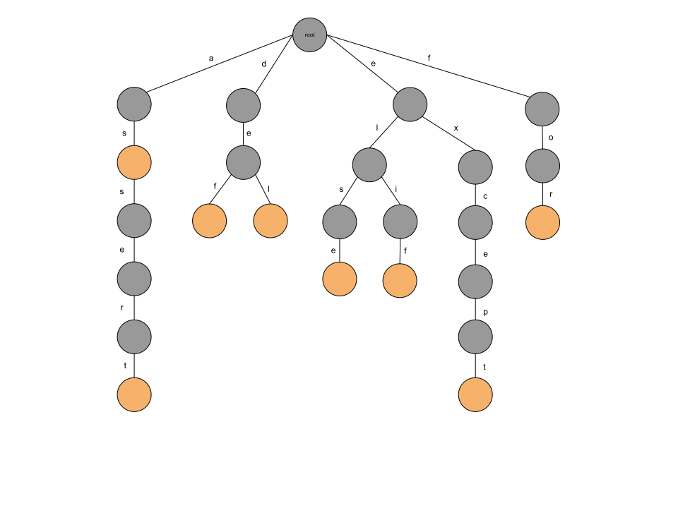
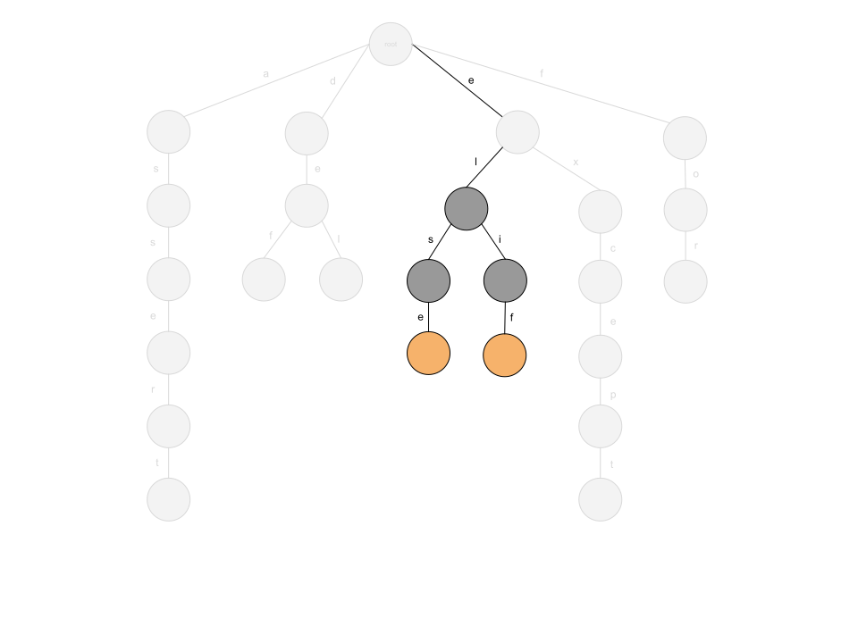

### Tries
 
[Tries](https://en.wikipedia.org/wiki/Trie) are interesting. They are an extension to n-ary trees structured for fast retrieval of data (most likely these will be strings). 

In terms of weirdness compared to basic trees, is the fact that any value stored in a trie is not just stored in any specific node, but instead the structure and parent-child relationships act as a sort of map to guide a "visitor" when traversing a tree to some destination node. The full value that is stored in the trie is accessible from some leaf node in the trie, but up to that leaf node can be store substrings of that value, though are not required to do so. For more details [here is a post with more about tries](https://drstearns.github.io/tutorials/trie/) that shows some of the mechanics and pseudo-code for operations like insertion and retrieval.

For simple strings quick summary is this — we store each string as a collection of trie nodes with pointers to child nodes representing a single letter going from your writing direction (left to right for English). Because of this storage, we need to tell which node signifies the "end" of the transition between characters i.e. the end of the string, so we mark those words with some value / flag. The depth of the tree is the length of the longest string inserted into a trie, and words that share the same characters share a path along the tree, diverging at a place where their characters no longer patch, i.e. the shared path is the prefix, hence why this is also sometimes called a prefix tree.

So, lets assume for sake of being more concrete that we have a list of words that comprise the "reserved keywords" in Python (this is a subset but a full list can be found [here](https://www.w3schools.com/python/python_ref_keywords.asp))

```python
as
assert
def
del
elif
else
except
for
```

If we insert them one-at-a-time the final state of the trie visualized will look like this



Lets define a class to represent a node in the trie

```python
# Definition for a Trie node.
class TrieNode:
    def __init__(self, text='', isWord=0):
        self.text = text
        self.isWord = isWord
        self.children = {}
```

then in Python this is all the code to implement this

```python
"""
Given a TrieNode for the root of the trie, inserts a given word into the trie. 
We signify that a given node is a 'leaf' / value node that represents an actual
string data stored in the trie by setting the 'isWord' flag, while other 
intermediary nodes will not have this set.
"""
def insert(root: TrieNode, word: str) -> None:
    curr = root
    for ch in word:
        if ch in curr.children:
            curr = curr.children[ch]
        else:
            text = curr.text + ch
            node = TrieNode(text=text)
            curr.children[ch] = node
            curr = node

    # Once we traverse every character in the 'key' string, the 'curr' TrieNode
    # is the node leaf node that we are actually performing the insertion for, 
    # so we mark it to know that this is not an intermediary node.
    curr.isWord = 1

# Our list of words.
keywords = ["as", "assert" "def", "del", "elif", "else", "except", "for"]

# Our initially empty trie.
trie = TrieNode()

# Insert each word one-by-one into the trie.
for word in keywords:
    insert(trie, word)

# --> At this point the state of 'trie' visualized looks like the image above.
```

### Autocomplete

Why do we at all care that the words are now stored like this? Well, assume we want to retrieve all keywords that we have stored — we start at the root and use our favorite DFS traversal to collect all the strings, no problem. What if we don't want all words, but only those that start with `"el"`? In autocomplete, a user may start typing characters such as "el" and wish to see suggestions of options that start with whatever the text is being typed, and in our concrete example a user might be typing in a code editor and wish to see "elif" and "else" options. Well, we again can:

- Do the same DFS to collect all the strings stored in the trie into a list
- Traverse the list & for each element in the array check if it begins with "el"
- Return the final filtered list

That doesn't seem to be efficient and there's fetching work which will be thrown away once we check the prefixes. Turns out, tries are specifically great for this type of query.

Recall that one stores strings in a trie by mapping child nodes with a key-value pair of a single letter to a given node, which tells a visitor that they can descend down this path further when traversing. That means that given a prefix we can just loop over each character in the given prefix string and arrive at a node which roots the subtree of any words that begin with this prefix (if any). That means that we can narrow down the space of the tree that we need to search and do so in just `O(length of prefix)` time. This would help us arrive at node after the letter "l", in the process ignoring nodes linking {"a", "d", "f"} and all their child nodes



Implementation-wise, all we need to do is have the same for-loop that we used to insert characters one-at-a-time, now just linearly traversing down the chain of nodes to the destination node. If we encounter a case where we can't find a link from a node to a child node for a given letter in our key, we know that this key cannot possibly be stored in the trie, hence we return nothing

```python
# 'trie' is the root of our Trie that perhaps was built with earlier insertions.
curr = trie

# User inputted string that we wish to use to look up words in the trie.
userInput = "el"

# Code to traverse the Trie linearly by iterating the characters in user-inputted
# string.
for ch in userInput:
    if ch in curr.children:
        curr = curr.children[ch]
    else:
        print(f"No words that start with {userInput} are stored in Trie")
    return None
```

Now that we are at the node linking "l" → {"s", "i"}, we know that whatever nodes we can reach by following the path via the children references down the tree will represent strings that share the prefix. Now that we're here, we can answer 2 questions pretty easily

1. Does the given prefix "el" represent an actual *word* stored in our trie?
2. Can we return the first `m` *words* (not substrings of words) that begin with the given prefix "el"?

For (1), we are asked to implement something like a "dictionary lookup" — for "el" the answer to if this is an actual word in our example would be "no", but for "else" the answer would be "yes". Recall that when adding strings (words) to the trie, we marked the node that represented the end of the word with a flag. Now in our current code, notice how after we are done with the loop that traverses the children links, the state of the `curr` node points exactly to the node which holds information about the string "el". That means that *if* "el" was an actual word that we inserted into our trie, then the node that is currently being pointed to by `curr` would have to have its flag value set to 1. Hence all we need to answer question (1) is check for this flag

```python
# 'trie' is the root of our Trie that perhaps was built with earlier insertions.
curr = trie

# User inputted string that we wish to use to look up words in the trie.
userInput = "el"

# Code to traverse the Trie linearly by iterating the characters in user-inputted
# string.
for ch in userInput:
    if ch in curr.children:
        curr = curr.children[ch]
    else:
        print(f"No words that start with {userInput} are stored in Trie")
    return None

if curr.isWord == 1:
    print(f"{userInput} is a valid word stored in the Trie")
else:
    print(f"{userInput} is *not* a valid word stored in the Trie")
```

For (2), we are asked to implement autocomplete, and at this stage we perform DFS with the root node being whatever `curr` is pointing to, in order to traverse this pruned subtree and gather all words that we encounter. Here is one implementation of pre-order DFS with a stack, gathering up to `m` words that must start with the given prefix

```python
# 'trie' is the root of our Trie that perhaps was built with earlier 
# insertions.
curr = trie

# User inputted string that we wish to use to look up words in the trie.
userInput = "el"

# Code to traverse the Trie linearly by iterating the characters in user-inputted
# string.
for ch in userInput:
    if ch in curr.children:
        curr = curr.children[ch]
    else:
        print(f"No words that start with {userInput} are stored in Trie")
    return None

# The 'curr' TrieNode is now pointing to the root of a subtree that contains 
# the all the strings (keys) stored in our trie that share the prefix that was 
# provided and that we used to search the trie.
#
# Now we can use DFS to traverse the subtree rooted by 'curr' and return the
# first 'm' values that we find.

# How many words we want to collect that start with the user-inputted string.
# This is the count of autocomplete suggestions that we are returning.
m = 3

stack = []
stack.append(curr)

autocomplete_suggestions = []
num_retrieved = 0

while stack:
    curr = stack.pop()
		
    # Only include this suggestion word if we haven't included too many
    # already and also if it is an actual word and not a substring somewhere
    # in-between in the trie.
    if curr.isWord == 1 and num_retrieved < m:
        autocomplete_suggestions.append(curr.text)
        num_retrieved += 1

    if num_retrieved >= m:
        return autocomplete_suggestions
    
    for ch in curr.children:
        stack.append(curr.children[ch])

# --> At this point 'autocomplete_suggestions' contains at most 'm' words
#     that were stored in the Trie and that match the user-inputted prefix.
```

For a simple follow-up you could ask whether the current autocomplete is case-sensitive and how to make it case-insensitive (i.e. typing "eL" would return the same suggestions of {"else", "elif"})